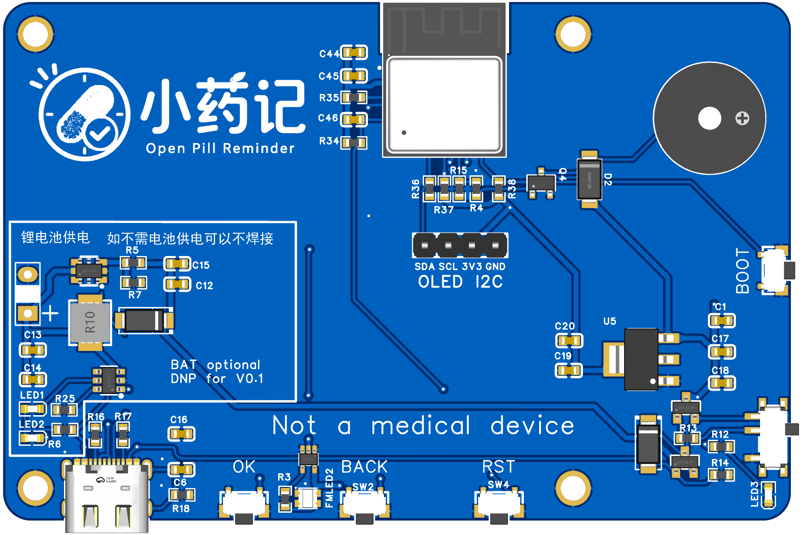
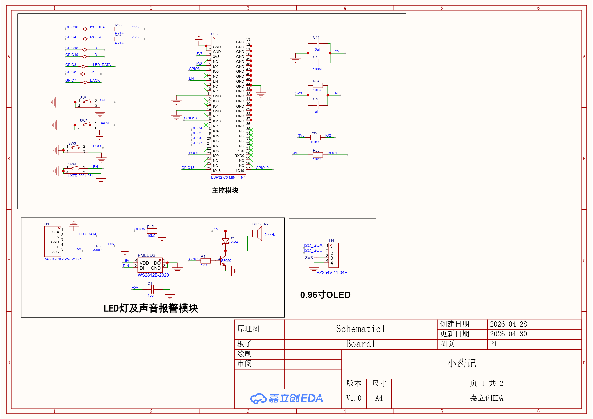

# PCB Notes

Chinese version: [README.md](./README.md)

The `DOC/PCB/` directory stores PCB project files and related hardware materials for Open Pill Reminder.

Currently included:

- [`小药记.eprj2`](./%E5%B0%8F%E8%8D%AF%E8%AE%B0.eprj2)
- [`小药记PCB.png`](<./小药记PCB.png>)
- [`小药记 3D图.png`](<./小药记 3D图.png>)
- [`3D_PCB1_2026-04-30.png`](./3D_PCB1_2026-04-30.png)
- [`SCH_Schematic1_1-P1_2026-04-30.png`](./SCH_Schematic1_1-P1_2026-04-30.png)
- [`SCH_Schematic1_2-P2_供电部分_2026-04-30.png`](<./SCH_Schematic1_2-P2_供电部分_2026-04-30.png>)

## Preview Images

### PCB Top View

### PCB 3D View

### Additional 3D Export

## Schematic Preview

### Schematic Page 1

### Schematic Page 2: Power Section

## Mechanical Constraint

This PCB has an important design constraint:

- It is intended to fit a `Raspberry Pi 4B` case

That means the PCB design must also satisfy:

- PCB outline matching the enclosure space
- Mounting holes matching the enclosure fixing points
- `USB-C` connector position matching the enclosure opening
- `OK` / `SET` button positions matching the enclosure button holes

Future PCB revisions should therefore check not only electrical correctness, but also:

- Board outline
- Hole locations
- Connector orientation
- Button locations
- Practical enclosure fit

## Notes

- `小药记PCB.png` works well as the main repository hardware preview
- `小药记 3D图.png` works well for enclosure and mechanical fit presentation
- The schematic preview pages provide a quick review entry for interfaces, power, and layout-related checks
